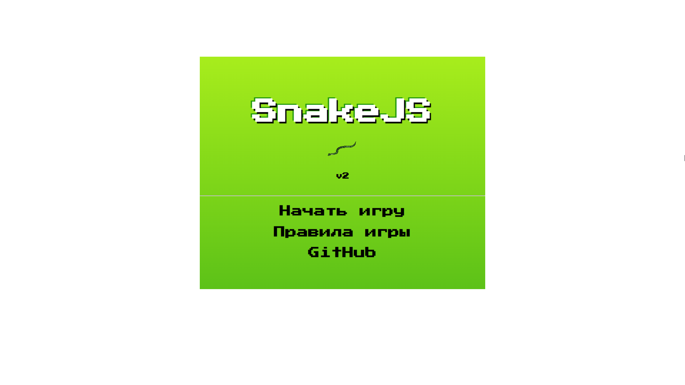
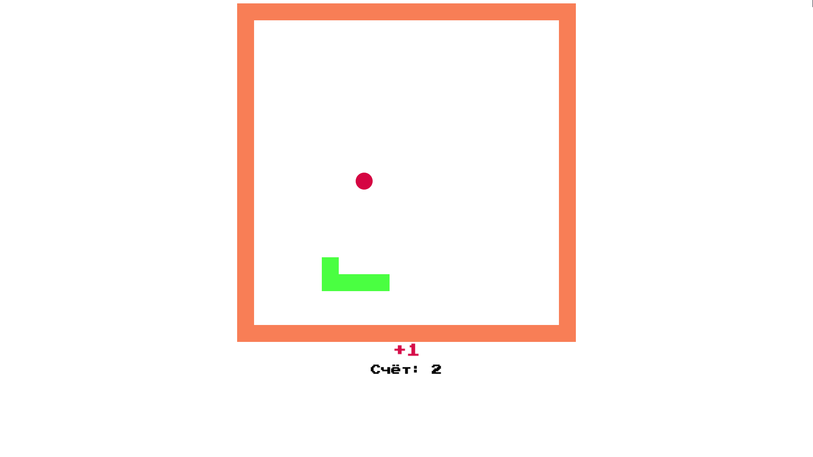

<h1>SnakeJS</h1>
<h3>v2</h3>

Классическая игра "Змейка". Написана на JavaScript и jQuery. Код игры основан на коде из учебника Н. Морган "JavaScript для детей", но сильно модифицирован. По сравнению с примером игры из книги доработан игровой процесс: скорость змейки изменяется по ходу игры, можно подбирать бонусы которые меняют скорость игры или длину змейки, слегка изменена графика.

Во второй версии полностью переработан код (в v1 всё сделано очень уж неряшливо), переработано управление (в игру можно играть и на мобильных устройствах) и слегка переделана графика. Так же доработана система бонусов и добавлено стартовое меню и меню game over.

<h3>Поиграть можно по этой <a href="http://zhuravskiyegor.ru/snake/">ссылке</a></h3>

