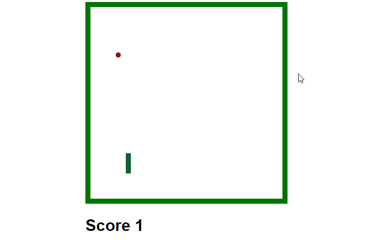

<h1>SnakeJS</h1>
<h3>v1</h3>

Классическая игра "Змейка". Написана на JavaScript и jQuery. Код игры основан на коде из учебника Н. Морган "JavaScript для детей", но сильно модифицирован. По сравнению с оригинальной игрой из книги доработан игровой процесс: скорость змейки изменяется по ходу игры, можно подбирать бонусы которые меняют скорость игры или длину змейки, слегка изменена графика.

